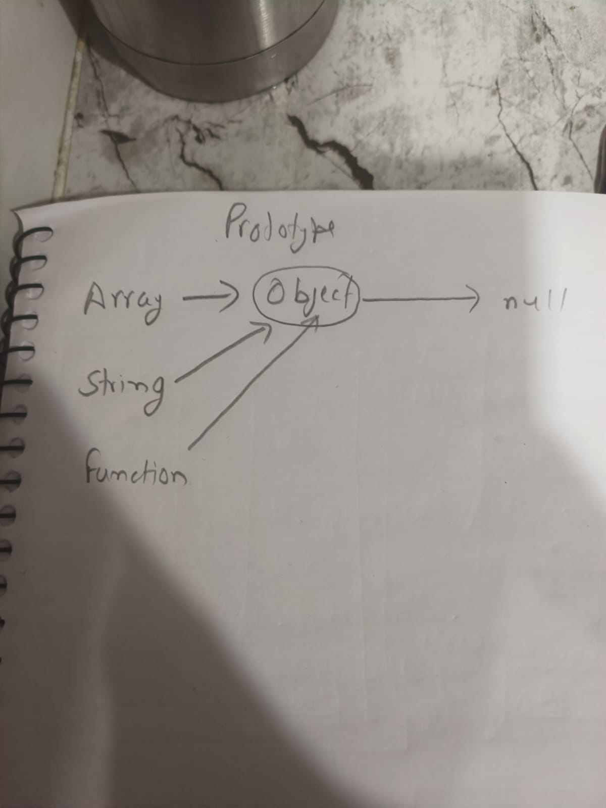

# javascript and classes

## OOP
```
It is basically Paradime
```

## Object
```
- Collection of Properties and meathods
- toLowerCase
```
## Why use OOP


## parts of OOP
```
Object literal(littteraly)

-Constructor function
-Prottypes
-Classes
-Instances(new,this)

```

## 4 Pillars
```
Abstractions
Encapsulations
Inheritance
Polymorphism

```
## 5 Prototypes.

<div align="center">
  
  <p><strong>Figure:</strong> OOP in JavaScript</p>
</div>

